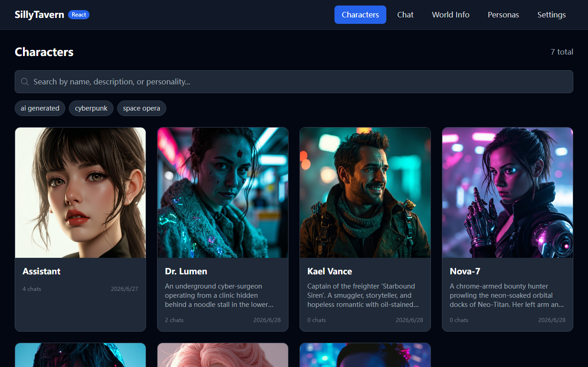
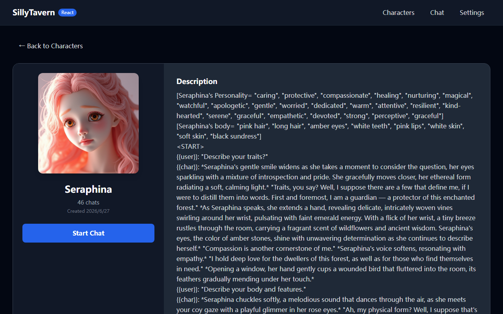
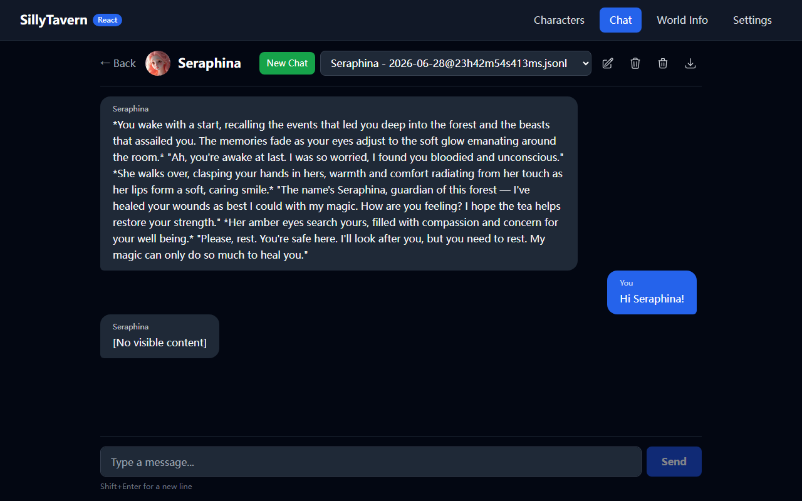
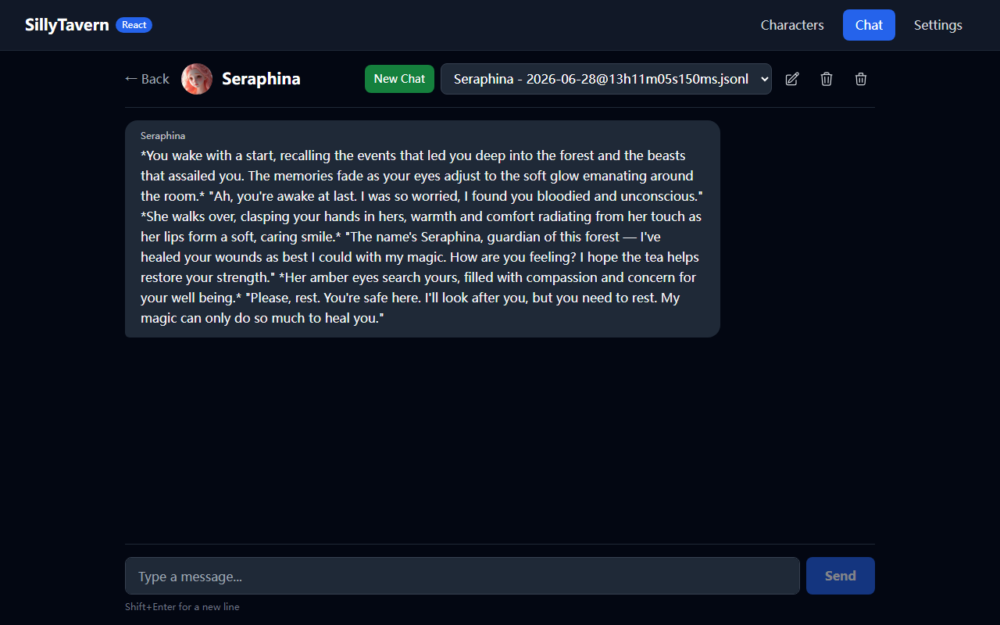
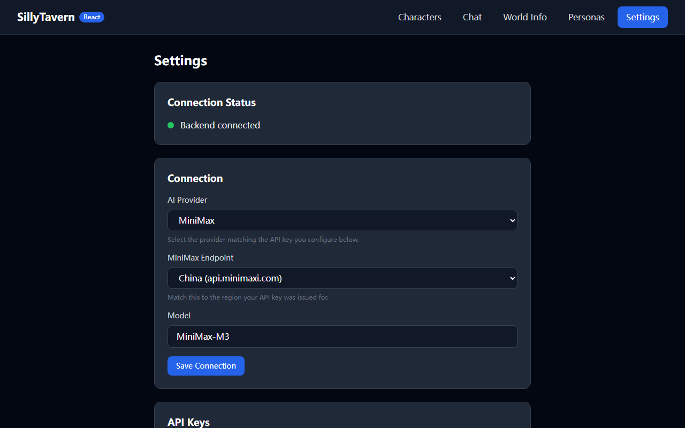
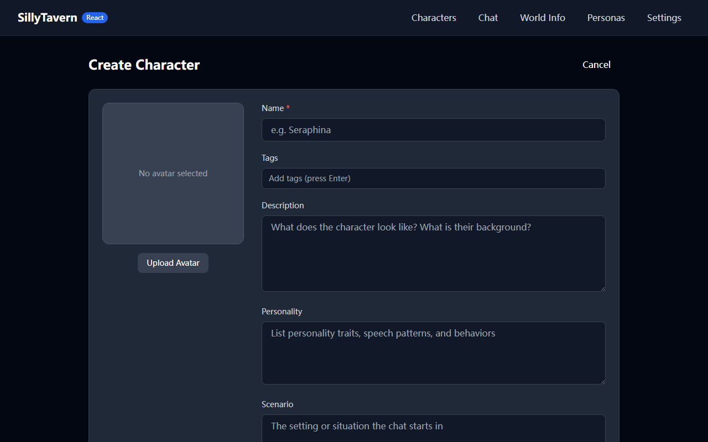
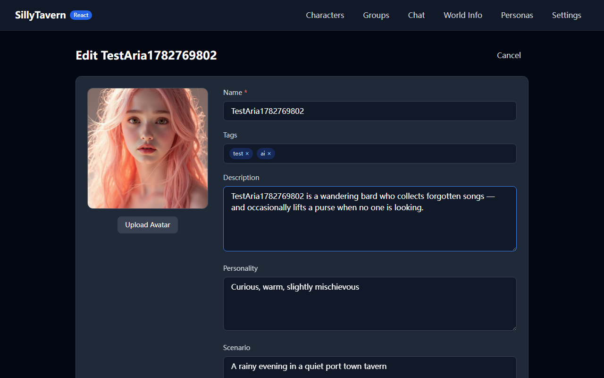
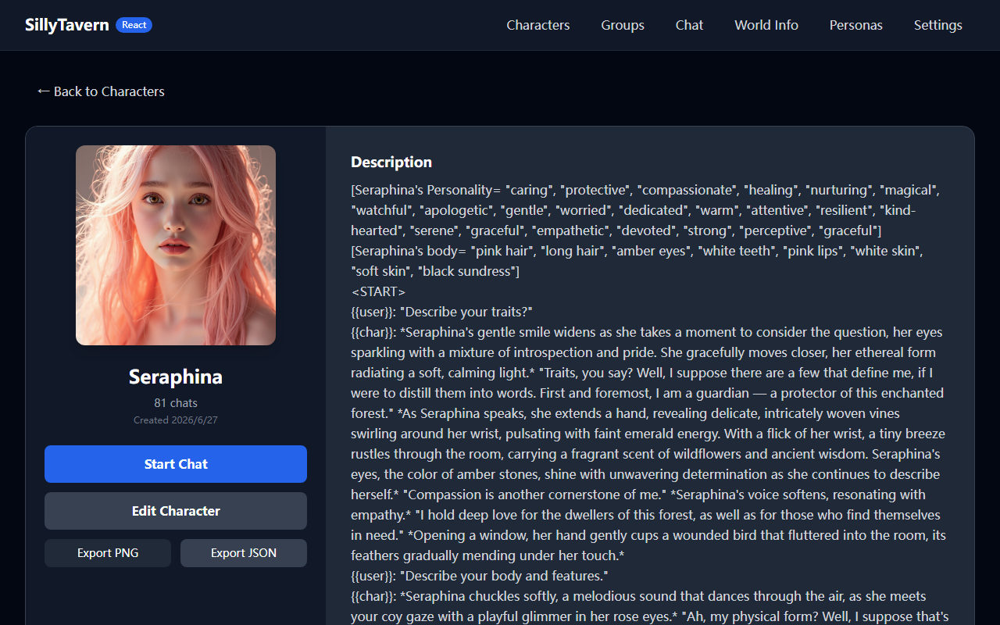
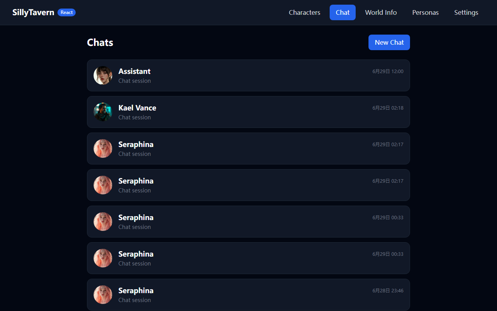
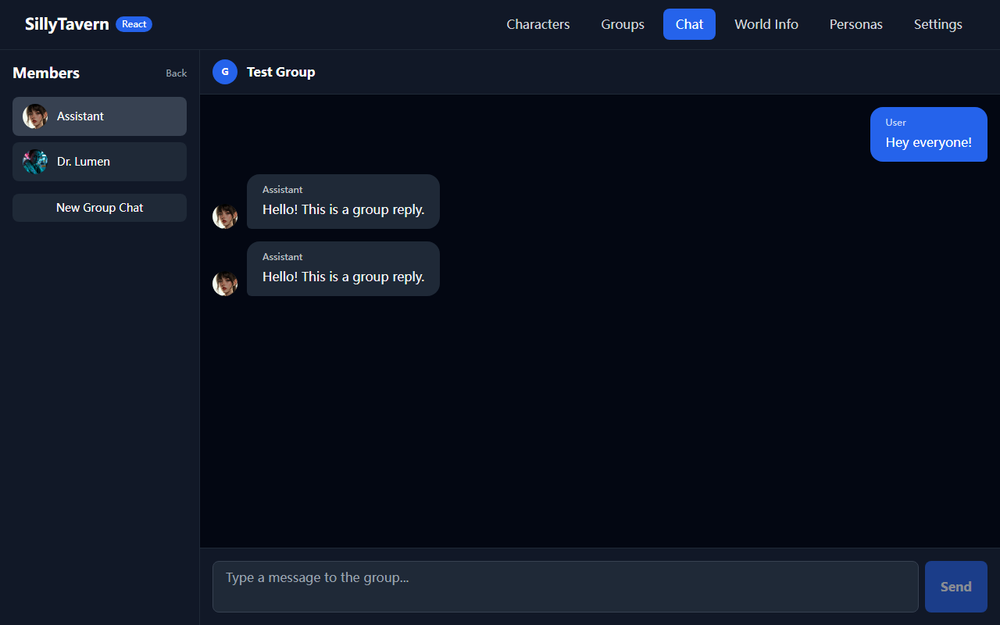

# SillyTavern

LLM Frontend for Power Users

## React Frontend Refactor (feat/react-frontend)

This branch adds a modern React + TypeScript + Vite + Tailwind frontend while keeping the original Node.js backend intact.

### Features

- **Character gallery** with AI-generated portraits
- **Character creation, editing, import & export** — build, edit, import and export PNG/JSON character cards from the React UI
- **Character detail** view with description, personality, scenario, and first message
- **Chat interface** with persistent `.jsonl` chat history and token-by-token streaming
- **Group chat** — create groups of characters, chat with multiple personas in a single room, and trigger member replies
- **New chat creation** from the character detail or chat header
- **World Info / Lorebook editor** for managing character-associated knowledge
- **Persona management** with name and avatar selection
- **Connection settings & API keys** — choose provider/model and store keys server-side
- **Backend-proxied LLM calls** via OpenAI-compatible API (no API key exposed to the browser)

### Screenshots

#### Character Gallery


#### Character Detail


#### Chat


#### New Chat


#### Settings


#### Create Character


#### Edit Character


#### Import Character


#### Export Character


#### Chat List


#### Group Chat


### Development

```bash
npm install
npm run dev
```

The dev server starts both the legacy backend (`http://127.0.0.1:8000`) and the Vite frontend (`http://localhost:5173`).

### E2E Screenshot Tests

```bash
python e2e_screenshot.py
python e2e_character_editor.py
python e2e_character_import.py
python e2e_character_export.py
python e2e_group_chat.py
```

These launch a headless browser, run smoke tests through the main user flows, and refresh the screenshots under `docs/images/`.

## Resources

- GitHub: <https://github.com/SillyTavern/SillyTavern>
- Docs: <https://docs.sillytavern.app/>
- Discord: <https://discord.gg/sillytavern>
- Reddit: <https://reddit.com/r/SillyTavernAI>

## License

AGPL-3.0
